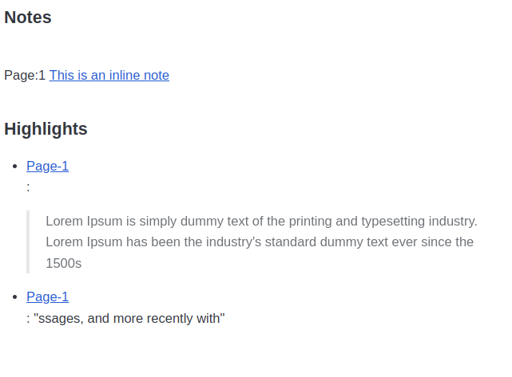

# extractPDFannotations
Python module to extract annotations from PDFs


## Usage 

```
python extractPDFAnnotations.py Lorem_ipsum.pdf 

```
#### Output
```html
<h2> Notes </h2><br>Page:1 <a href="Lorem_ipsum.pdf#page=1">This is an inline note</a><br><br><h2>Highlights</h2>

<ul>
<li><p><a href="Lorem_ipsum.pdf#page=1">Page-1</a><br>:</p>

<blockquote>
  <p>Lorem Ipsum is simply dummy text of the printing and typesetting industry. Lorem Ipsum has been the industry's standard dummy text ever since the 1500s</p>
</blockquote></li>
<li><p><a href="Lorem_ipsum.pdf#page=1">Page-1</a><br>: "ssages, and more recently with"</p></li>
</ul>

```

#### Output (Rendered)


